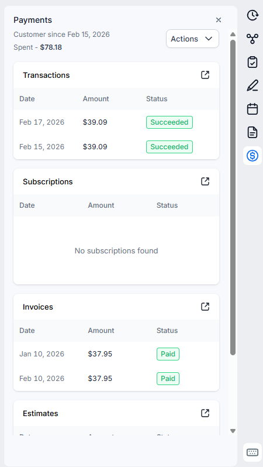
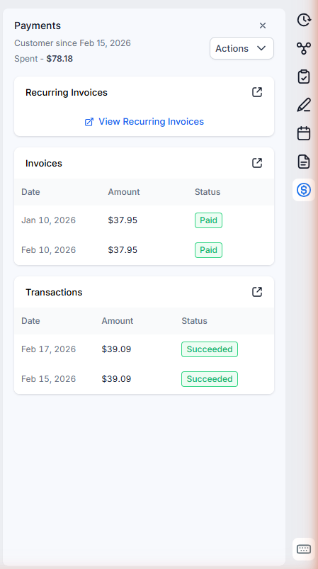

# Custom Payments Sidebar

I was frustrated that GHL's Payments sidebar on contact detail pages shows sections I never use (Subscriptions, Estimates) and doesn't link to Recurring Invoices. Finding a contact's recurring invoice schedule meant navigating to the Recurring Templates page and manually searching by name.

This script customizes the Payments sidebar: hide unused sections, reorder the ones you keep, and add a "Recurring Invoices" link that opens the Recurring Templates page pre-filtered by the contact's last name.

If you found this helpful, let me know at eric@uplevelpro.com

You must be an agency owner to use this script, not a subaccount in an agency.

If you don't have a GHL agency account yet, click here to get a free trial: https://www.gohighlevel.com/?fp_ref=uplevelpro32

## Before & After

> 
> 

## Installation

1. In your GHL agency, go to **Settings > Whitelabel > Custom Code > Custom JS**
2. Copy the entire contents of [`ghl-custom-payments-sidebar.js`](./ghl-custom-payments-sidebar.js)
3. Paste it into the Custom JS field
4. Click **Save**

That's it. The script applies automatically to all sub-accounts across your agency.

## What It Does

- **Hides unused sidebar sections** — Subscriptions, Estimates, or any combination you configure
- **Reorders remaining sections** — Puts them in the order you want (e.g., Invoices before Transactions)
- **Adds a "Recurring Invoices" link** — Opens the Recurring Templates page in a new tab, pre-filtered by the contact's last name
- **Auto-fills the search box** — When the Recurring Templates page opens with the search hash, the search box is automatically populated and the table filters to show only that contact's recurring invoices
- **Survives SPA navigation** — Works when clicking between contacts, re-applies when GHL re-renders the sidebar
- **Location filtering** — Optionally restrict to specific sub-accounts by location ID

## Configuration

The script includes a `CONFIG` object at the top that you can adjust:

| Option | Default | Description |
|--------|---------|-------------|
| `HIDDEN_SECTIONS` | `['Subscriptions', 'Estimates']` | Array of section names to hide from the Payments sidebar. Use exact header text. Set to `[]` to hide nothing |
| `SECTION_ORDER` | `['Invoices', 'Transactions']` | Desired order of visible native sections. The Recurring Invoices link is always first. Unlisted sections keep their native position |
| `SHOW_RECURRING_LINK` | `true` | Show the "Recurring Invoices" link section at the top of the sidebar. Set to `false` if you only want to hide/reorder native sections |
| `ALLOWED_LOCATION_IDS` | `[]` | Array of GHL location IDs to restrict the script to. Set to `[]` to run on all locations |
| `DEBUG` | `true` | Set to `false` to disable `[Custom Payments Sidebar]` console logging |

### Common Configurations

**Hide Subscriptions only, keep everything else:**
```javascript
HIDDEN_SECTIONS: ['Subscriptions'],
SECTION_ORDER: ['Invoices', 'Transactions'],
SHOW_RECURRING_LINK: true,
```

**Just reorder sections (no hiding, no recurring link):**
```javascript
HIDDEN_SECTIONS: [],
SECTION_ORDER: ['Invoices', 'Transactions'],
SHOW_RECURRING_LINK: false,
```

**Only show Recurring Invoices link (hide all native sections):**
```javascript
HIDDEN_SECTIONS: ['Subscriptions', 'Estimates', 'Invoices', 'Transactions'],
SECTION_ORDER: [],
SHOW_RECURRING_LINK: true,
```

**Restrict to a specific sub-account:**
```javascript
ALLOWED_LOCATION_IDS: ['your-location-id-here'],
```

### Customizing Section Order

The `SECTION_ORDER` array controls which native sections appear and in what order. Sections are positioned after the Recurring Invoices link (if enabled) and the stats row at the top.

- Sections you list in `SECTION_ORDER` are moved into that exact order
- Sections you don't list keep their native position (below the ordered ones)
- Sections you add to `HIDDEN_SECTIONS` are hidden regardless of whether they appear in `SECTION_ORDER`

The four native section names are: `Transactions`, `Subscriptions`, `Invoices`, `Estimates`. Use these exact strings — they must match the sidebar header text.

**Example — Transactions first, then Invoices:**
```javascript
SECTION_ORDER: ['Transactions', 'Invoices'],
```

## How It Works

### Contact Detail Page (`/contacts/detail/{contactId}`)

1. **Section Hiding** — Finds each sidebar section by its `<p>` header text (e.g., "Subscriptions") and hides the parent `.mt-3` container
2. **Recurring Invoices Link** — Creates a new section matching the native GHL sidebar structure with a link to `/payments/recurring-templates#search=LastName`. The last name is read from the contact's form fields in the left sidebar
3. **Section Reordering** — Moves the injected section to the top (after the stats row), then reorders native sections per `SECTION_ORDER`
4. **MutationObserver** — Watches for GHL DOM re-renders and re-applies hiding, insertion, and reordering as needed
5. **URL Watcher** — Polls for SPA navigation changes and rebuilds the section when switching contacts

### Recurring Templates Page (`/payments/recurring-templates`)

1. **Hash Detection** — Reads `#search=LastName` from the URL hash
2. **Search Auto-Fill** — Uses the native `HTMLInputElement` value setter to bypass Vue's reactivity wrapper, then dispatches `input` and `compositionend` events to trigger Naive UI's search filtering
3. **Hash Cleanup** — Removes the hash from the URL via `history.replaceState` so it doesn't persist on reload

## Compatibility

- Designed for GHL's agency-level Custom JS injection
- Targets Contact Detail pages and the Recurring Templates page
- No external dependencies — pure vanilla JavaScript
- No CSS files required (styles are injected inline)

## Author

**Eric Langley** | [UpLevelPro.com](https://www.uplevelpro.com)

## License

[MIT](../LICENSE)
