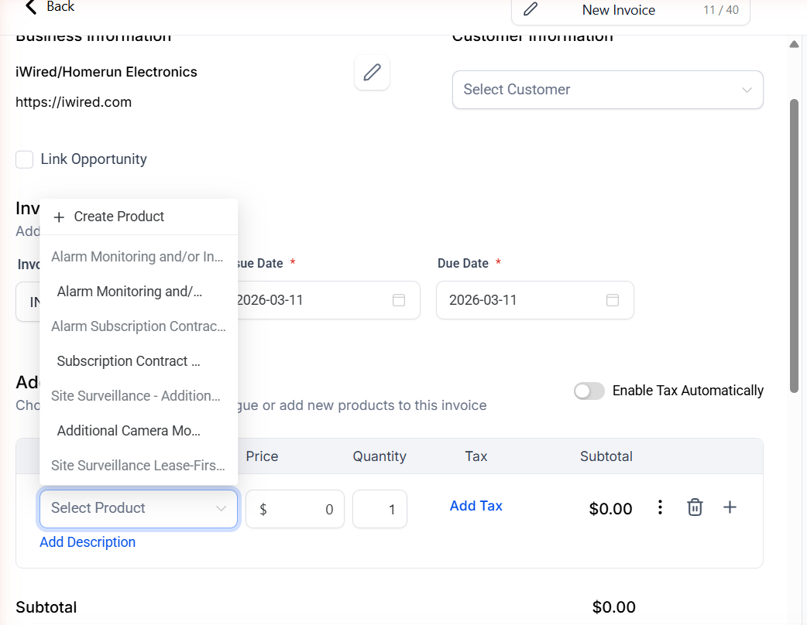
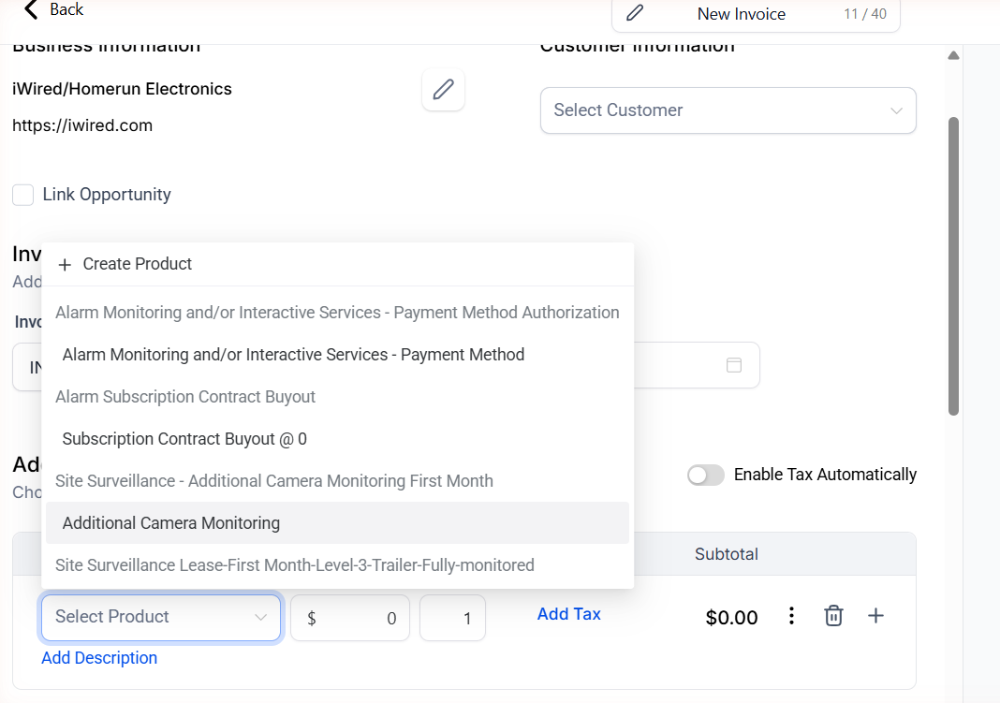

# Invoice Product Dropdown Width Fix

When creating invoices in GHL, the "Select Product" dropdown is too narrow to display full product names. Long names like "Alarm Monitoring and/or Interactive Services - Payment Method Authorization" get truncated with ellipsis, making it hard to pick the right product. This script widens the dropdown menu so you can read the full product name before selecting it.

The trigger field ("Select Product") stays its normal width — only the dropdown popup gets wider.

If you found this helpful, let me know at eric@uplevelpro.com

You must be an agency owner to use this script, not a subaccount in an agency.

If you don't have a GHL agency account yet, click here to get a free trial: https://www.gohighlevel.com/?fp_ref=uplevelpro32

## Before & After

> 
> 

## Installation

1. In your GHL agency, go to **Settings > Whitelabel > Custom Code > Custom JS**
2. Copy the entire contents of [`ghl-invoice-product-dropdown-width.js`](./ghl-invoice-product-dropdown-width.js)
3. Paste it into the Custom JS field
4. Click **Save**

That's it. The script applies automatically to all sub-accounts across your agency.

## What It Does

- **Widens the product dropdown menu** — Expands the popup to fit full product names (450–700px) instead of the default ~205px
- **Keeps the trigger field narrow** — The "Select Product" input stays its normal size in the invoice form layout
- **Removes text truncation** — Disables the ellipsis (`...`) on option text so names display in full
- **Only targets product dropdowns** — Identifies the product dropdown by its "Create Product" header button, leaving other dropdowns untouched
- **Only active on invoice pages** — Scoped to `/payments/invoices` URLs so it doesn't interfere elsewhere
- **Survives SPA navigation** — Uses GHL route events and history API hooks to stay active across page transitions

## Configuration

The script includes a `CONFIG` object at the top that you can adjust:

| Option | Default | Description |
|--------|---------|-------------|
| `MIN_WIDTH` | `450` | Minimum width (px) for the expanded dropdown menu. Increase if your product names are very long |
| `MAX_WIDTH` | `700` | Maximum width (px) so the dropdown doesn't grow unbounded |
| `ALLOWED_LOCATION_IDS` | `[]` | Array of GHL location IDs to restrict the script to. Set to `[]` to run on all locations |
| `DEBUG` | `true` | Set to `false` to disable `[Invoice Product Dropdown]` console logging |

## How It Works

1. **MutationObserver** — Watches `document.body` for new child elements being added to the DOM
2. **Menu Detection** — When a Naive UI select menu (`.n-base-select-menu`) appears, checks for the `.create-product-btn` element in its header to confirm it's a product dropdown (not a tax, customer, or other select)
3. **Width Override** — Sets `min-width`, `max-width`, and `width: max-content` on both the menu and its positioned container (`.v-binder-follower-content`), using `!important` to override the inline styles that lock the dropdown to the trigger width
4. **Text Truncation Fix** — Removes `overflow: hidden`, `text-overflow: ellipsis` from each `.n-base-select-option__content` element so the full product name is visible
5. **Page Scoping** — Only activates the observer on `/payments/invoices` pages, detected via GHL route events (`routeLoaded`, `routeChangeEvent`) and `history.pushState`/`replaceState` fallbacks

## Compatibility

- Designed for GHL's agency-level Custom JS injection
- Targets the New Invoice and Edit Invoice pages
- No external dependencies — pure vanilla JavaScript
- No CSS files required (styles are applied inline via JavaScript)

## Author

**Eric Langley** | [UpLevelPro.com](https://www.uplevelpro.com)

## License

[MIT](../LICENSE)
