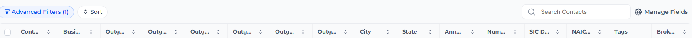

# Smart List Column Auto-Fit

I was frustrated that GHL's Contacts Smart List truncates column headers and provides no way to save resized columns. 

This script automatically fits every column to show full header names and cell content. 

If you found this helpful, let me know at eric@uplevelpro.com 

You must be an agency owner to use this script, not a subaccount in an agency. 
If you don't have a GHL agency account yet, click here to get a free trial: https://www.gohighlevel.com/?fp_ref=uplevelpro32

I'm also available for GHL or AI-based custom projects.

## Before & After

> 
> 

Note: With a lot of fields the scroll bar will used to view all of the fields. A handy way to scroll without clicking and grabbing the bar is to press and hold the Shift key and then use the mouse button scroll wheel to scroll sideways.

## Installation

1. In your GHL agency, go to **Settings > Whitelabel > Custom Code > Custom JS**
2. Copy the entire contents of [`ghl-smartlist-autofit-columns.js`](./ghl-smartlist-autofit-columns.js)
3. Paste it into the Custom JS field
4. Click **Save**

That's it. The script applies automatically to all sub-accounts across your agency.

## What It Does

- Detects when a Smart List page loads (via URL pattern matching)
- Measures each column header's text width and the widest cell content across visible rows
- Sets each column to the optimal width (minimum 100px, maximum 400px)
- Survives **sorting**, **filtering**, **pagination**, and **Manage Fields** changes without losing column sizing
- Works with GHL's SPA navigation — auto-fits columns when switching between Smart Lists

## Configuration

The script includes a `CONFIG` object at the top that you can adjust:

| Option | Default | Description |
|--------|---------|-------------|
| `MIN_WIDTH` | `100` | Minimum column width in pixels |
| `MAX_WIDTH` | `400` | Maximum column width in pixels |
| `HEADER_PADDING` | `60` | Extra pixels added to header text width (accounts for sort icon and breathing room) |
| `CELL_PADDING` | `30` | Extra pixels added to cell text width |
| `SAMPLE_ROWS` | `15` | Number of visible rows sampled to determine cell content width |
| `POLL_INTERVAL` | `300` | Milliseconds between checks while waiting for the table to render |
| `POLL_TIMEOUT` | `8000` | Maximum milliseconds to wait for the table before giving up |
| `DEBUG` | `true` | Set to `false` to disable `[SmartList AutoFit]` console logging |

## How It Works

1. **SPA Navigation Detection** — Hooks into `history.pushState`, `history.replaceState`, and `popstate` events to detect page changes within GHL's single-page app
2. **Table Detection** — Polls for Tabulator.js table elements (`.tabulator-col` headers and `.tabulator-row` rows) until they render
3. **Text Measurement** — Creates an offscreen `` with the same font as each header/cell, measures its pixel width, and determines the optimal column width
4. **Width Application** — Sets `style.width` on both `.tabulator-col` (header) and `.tabulator-cell` (body) elements for each field
5. **MutationObserver** — Watches `#table-container` for DOM changes. When rows change (sort/filter), it re-applies stored widths. When column structure changes (Manage Fields), it re-measures everything

## Compatibility

- Designed for GHL's agency-level Custom JS injection
- Targets the Contacts Smart List pages (`/v2/location/.../contacts/smart_list/...`)
- No external dependencies — pure vanilla JavaScript
- No CSS required

## Author

**Eric Langley** | [UpLevelPro.com](https://www.uplevelpro.com)

## License

[MIT](../LICENSE)
